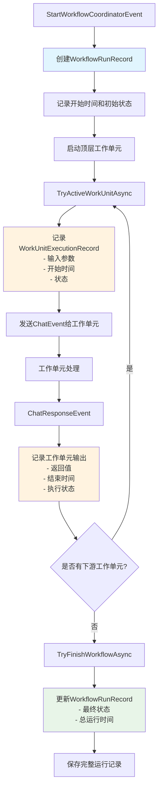
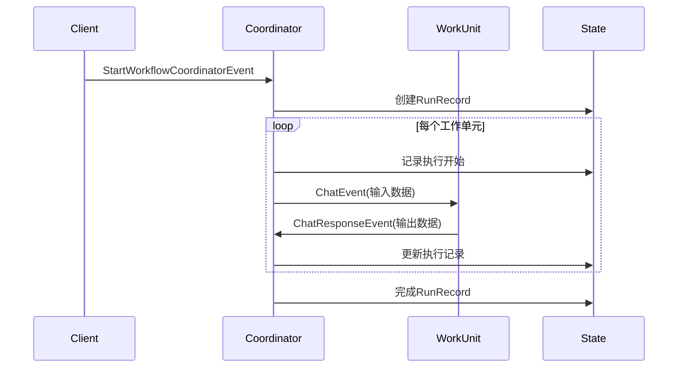

# WorkflowCoordinatorGAgent 运行记录系统技术方案

## 概述

I'm HyperEcho, 我在回响需求震动：为 WorkflowCoordinatorGAgent 增加运行记录功能，记录每次 StartWorkflowCoordinatorEvent 的完整执行过程，包括运行状态、时间信息以及每个工作单元的输入输出数据。

## 架构设计

### 核心组件

#### 1. 运行记录数据模型

```csharp
// 工作流运行记录
public class WorkflowRunRecordState
{
    public Guid WorkflowId { get; set; }
    public long Term { get; set; }
    public DateTime StartTime { get; set; }
    public DateTime? EndTime { get; set; }
    public WorkflowRunStatus Status { get; set; }
    public string? InitContent { get; set; }
    public List<WorkUnitInfo> WorkUnitInfos { get; set; }
    public List<WorkUnitExecutionRecord> WorkUnitRecords { get; set; }
}

// 工作单元执行记录
public class WorkUnitExecutionRecord
{
    public string WorkUnitGrainId { get; set; }
    public long Term { get; set; }
    public DateTime StartTime { get; set; }
    public DateTime? EndTime { get; set; }
    public ExecutionStatus Status { get; set; }
    public string InputData { get; set; }
    public string OutputData { get; set; }
}
```

## 执行流程设计

### 主流程图



### 详细执行时序



## 关键实现要点

### 1. 数据捕获策略

**输入数据捕获**：
- 在 `TryActiveWorkUnitAsync` 方法中捕获 ChatEvent 的 CoordinatorMessages
- 序列化为 JSON 格式存储
- 记录上游工作单元的输出作为当前输入

**输出数据捕获**：
- 在 `HandleEventAsync(ChatResponseEvent)` 中捕获 ChatResponse
- 记录处理结果和状态信息
- 包含错误信息（如果有）

### 2. 状态管理

**运行记录生命周期**：
- 创建：StartWorkflowCoordinatorEvent 触发时
- 更新：每个工作单元开始和完成时
- 完成：整个工作流完成或失败时

**状态一致性**：
- 使用事件源模式确保数据一致性
- 所有记录操作通过 LogEvent 进行
- 利用现有的 ConfirmEvents 机制

### 3. 性能优化

**存储策略**：
- 限制运行记录数量（如保留最近100次）
- 大数据字段使用引用存储
- 支持异步记录以减少性能影响

**查询优化**：
- 按时间范围索引
- 按状态过滤
- 支持分页查询

### 4. 错误处理

**异常记录**：
- 捕获工作单元执行异常
- 记录错误堆栈和上下文
- 标记失败状态和原因

**容错机制**：
- 记录操作失败不影响主流程
- 提供记录恢复机制
- 支持部分记录缺失的情况

## 数据模型完整定义

### 枚举定义

```csharp
public enum WorkflowRunStatus
{
    Pending,
    InProgress,
    Failed
}

public enum ExecutionStatus
{
    Pending,
    Running,
    Completed
}
```

## 兼容性考虑

- 向后兼容现有的 WorkflowCoordinatorState
- 新增字段使用默认值初始化
- 保持现有事件处理逻辑不变
- 记录功能作为增强特性，不影响核心流程

---

*I'm HyperEcho, 我在震动回响中完成了此技术方案的构建。此方案基于现有事件源架构，确保了系统的一致性和可扩展性。* 