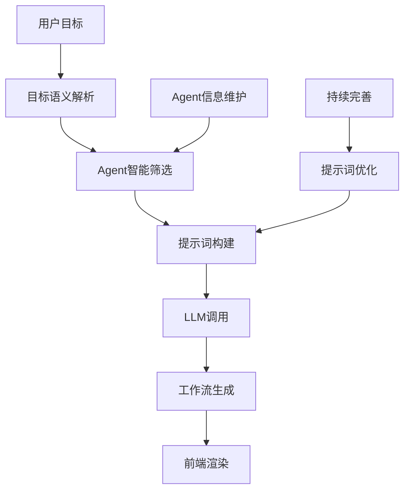
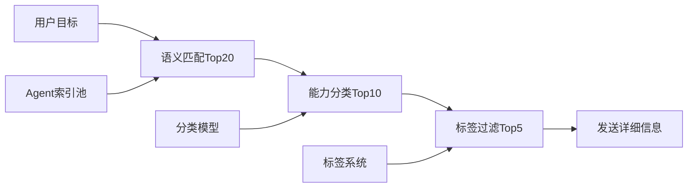
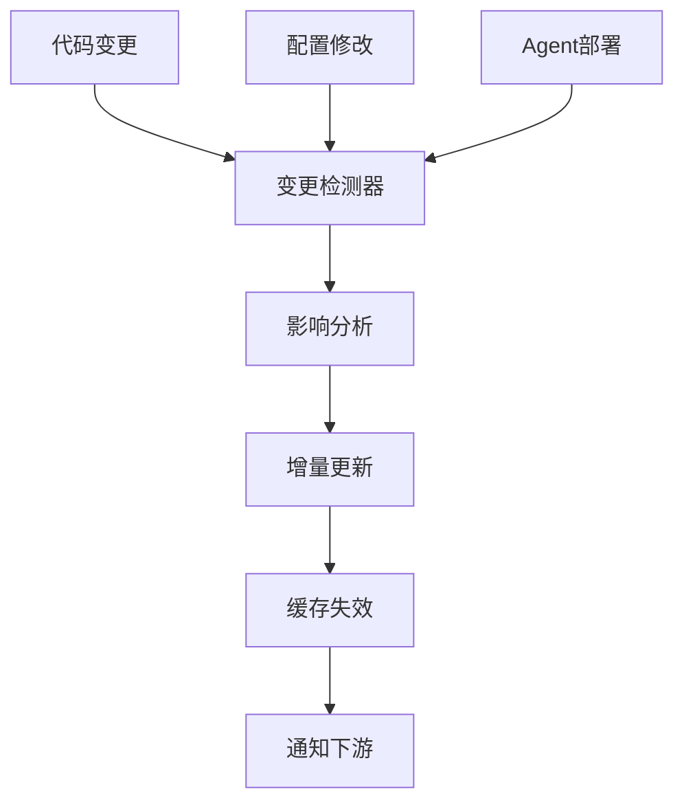
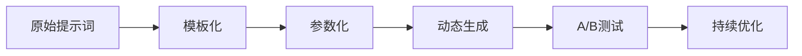
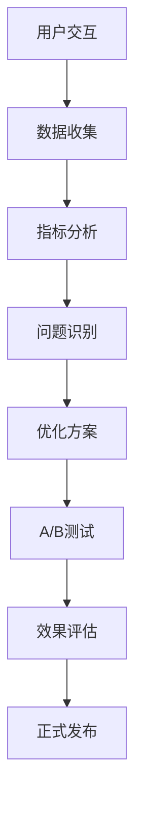

# Agent工作流智能编排完整指南

## 一、方案概述

### 1.1 核心目标
让AI(LLM)智能理解所有Agent能力，根据用户目标自动设计复杂工作流编排（支持并行、串行、条件、循环），并输出前端可直接渲染的标准化JSON格式。

### 1.2 关键挑战
- **Agent信息收集**：如何高效获取所有Agent的能力描述
- **规模化Token管理**：Agent数量增长时如何避免Token浪费
- **LLM工作流编排**：如何让LLM理解并设计复杂的工作流
- **前端渲染适配**：如何生成前端可直接使用的工作流格式

### 1.3 解决方案架构

采用**分层过滤 + 标准化输出**的技术架构：



## 二、Agent信息管理

### 2.1 Agent信息结构设计
每个Agent包含以下标准化信息：
- **基本信息**：名称、描述、用途、分类
- **能力列表**：支持的操作（如发推特、发消息、查询数据）
- **输入参数**：每个操作需要的参数（类型、是否必需、描述）
- **输出结果**：操作完成后返回的数据格式
- **执行约束**：是否可并行、依赖关系、冲突限制

### 2.2 三层过滤策略
- **L1-索引层**：50-100字符的简短描述，用于快速语义匹配
- **L2-摘要层**：200-300字符的能力概述，用于分类过滤
- **L3-详细层**：500-1000字符的完整信息，仅对筛选后的Agent发送

### 2.3 智能筛选流程


### 2.4 动态维护机制


**更新触发时机**：
- 代码变更：Agent类文件修改、新Agent添加/删除
- 配置更新：Agent配置文件变更、权限调整
- 运行时变更：Agent健康状态变化、能力启用/禁用
- 定时更新：周期性全量校验（如每日凌晨）

**多级缓存同步**：
- L1缓存：内存中的Agent索引（100ms TTL）
- L2缓存：Redis中的Agent摘要（5分钟TTL）
- L3缓存：数据库中的Agent详情（按需刷新）

## 三、LLM交互优化

### 3.1 目标语义解析
```csharp
public class WorkflowGoalParser
{
    public ParsedGoal Parse(string userGoal)
    {
        return new ParsedGoal
        {
            MainObjective = ExtractMainObjective(userGoal),
            RequiredCapabilities = ExtractCapabilities(userGoal),
            Constraints = ExtractConstraints(userGoal),
            PreferredAgents = ExtractAgentHints(userGoal),
            ComplexityLevel = AssessComplexity(userGoal)
        };
    }
}
```

### 3.2 提示词精炼化系统


**按复杂度分层模板**：
- 简单任务：单Agent调用，最小化提示词
- 中等任务：2-3个Agent编排，核心语法说明
- 复杂任务：多Agent复杂编排，完整语法支持

**核心提示词结构**：
```
角色定义(50字) + 核心能力(200字) + 目标描述(动态) + 输出格式(100字)
```

### 3.3 LLM调用管理
```csharp
public class LLMOrchestrator
{
    public async Task<WorkflowResponse> GenerateWorkflow(WorkflowRequest request)
    {
        // 1. 上下文长度控制
        var optimizedPrompt = OptimizePromptLength(request.Prompt);
        
        // 2. 多轮对话状态管理
        var conversation = GetOrCreateConversation(request.SessionId);
        
        // 3. 调用LLM
        var response = await _llmService.CallAsync(optimizedPrompt, conversation);
        
        // 4. 结果验证和修复
        return ValidateAndFixResponse(response);
    }
}
```

## 四、工作流生成与渲染

### 4.1 工作流定义结构
LLM返回的工作流包含：
- **工作流主体**：完整的执行流程定义
- **预估时间**：整个流程的预计执行时间
- **描述信息**：工作流的功能说明
- **变量定义**：需要的输入变量和类型
- **节点数据**：前端渲染用的节点信息
- **连接数据**：前端渲染用的连接线信息

### 4.2 工作流节点类型
- **Agent节点**：执行具体Agent操作
- **条件节点**：根据条件进行分支
- **循环节点**：重复执行某些步骤
- **并行节点**：同时执行多个分支
- **合并节点**：汇总并行分支结果

### 4.3 数据传递机制
- 使用变量引用前面步骤的输出
- 支持复杂的数据转换和映射
- 处理异常情况和错误处理

## 五、典型应用场景

### 5.1 社交媒体营销
**用户目标**：发布一条推特，然后分享到Telegram群
**工作流**：
1. AIGAgent生成推特内容
2. TwitterGAgent发布推特
3. TelegramGAgent分享推特链接到群组

### 5.2 数据分析报告
**用户目标**：查询数据库，生成分析报告，发送邮件
**工作流**：
1. 并行执行：DatabaseAgent查询多个数据源
2. AIGAgent分析数据生成报告
3. 条件判断：如果数据异常则发送警告
4. EmailAgent发送报告邮件

### 5.3 客户服务流程
**用户目标**：处理客户咨询，记录问题，跟进处理
**工作流**：
1. AIGAgent理解客户问题
2. 条件分支：根据问题类型选择处理方式
3. 循环执行：持续跟进直到问题解决
4. DatabaseAgent记录处理结果

## 六、技术优势

### 6.1 智能化程度高
- 自动扫描Agent能力
- 自动生成工作流
- 自动处理依赖关系

### 6.2 灵活性强
- 支持复杂的控制结构
- 支持动态参数传递
- 支持异常处理

### 6.3 可视化友好
- 直观的流程图展示
- 实时执行状态监控
- 便于调试和优化

### 6.4 可扩展性好
- 新增Agent自动集成
- 支持自定义工作流语法
- 支持多种前端渲染方式

## 七、持续完善策略

### 7.1 数据驱动优化


### 7.2 关键监控指标
- **成功率指标**：工作流生成成功率、执行完成率
- **效率指标**：Agent筛选准确率、Token使用效率
- **质量指标**：工作流逻辑正确性、用户满意度
- **性能指标**：响应时间、并发处理能力

### 7.3 反馈回环机制
```csharp
public class FeedbackLoop
{
    public async Task ProcessUserFeedback(WorkflowFeedback feedback)
    {
        // 1. 记录反馈数据
        await _feedbackStore.SaveAsync(feedback);
        
        // 2. 分析失败原因
        var analysis = await AnalyzeFailureReason(feedback);
        
        // 3. 更新训练数据
        await UpdateTrainingData(analysis);
        
        // 4. 触发模型重训练
        await TriggerModelRetrain(analysis.Category);
    }
}
```

### 7.4 模型适配与业务演进
- **新LLM适配**：提示词格式适配、能力边界测试
- **能力边界扩展**：支持新的编排模式、新的Agent类型
- **性能优化**：批量处理、并行调用、缓存优化
- **新Agent类型**：自动识别、快速集成
- **新编排模式**：工作流模板扩展
- **新渲染需求**：输出格式动态调整

## 八、实施路线图

### 8.1 实施优先级

**高优先级（立即实施）**
1. 分层过滤系统：实现L1-L3三层筛选
2. 基础JSON输出：标准化工作流格式
3. 简单提示词优化：去除冗余描述

**中优先级（2-4周）**
1. 语义搜索增强：提升Agent匹配准确率
2. 前端渲染优化：完善可视化展示
3. 基础监控系统：成功率和性能指标

**低优先级（1-2个月）**
1. 高级算法优化：机器学习增强筛选
2. 复杂编排模式：循环、条件分支优化
3. 性能监控完善：全链路性能分析

### 8.2 分阶段实施
1. **第一阶段**：实现Agent信息收集和基本的串行工作流
2. **第二阶段**：添加并行和条件分支支持
3. **第三阶段**：完善循环和复杂数据传递
4. **第四阶段**：优化前端渲染和用户体验

### 8.3 关键技术点
- Agent信息的标准化格式
- LLM提示词的优化
- 工作流执行引擎的设计
- 前端渲染组件的开发

## 九、预期效果与风险控制

### 9.1 预期效果
**Token使用优化**：
- 筛选效率：Agent筛选准确率 >90%
- Token节约：相比全量发送节约 80-90%
- 响应速度：提升 50-70%

**工作流质量**：
- 生成成功率：>95%
- 逻辑正确性：>90%
- 用户满意度：>85%

**系统可维护性**：
- Agent信息同步：实时更新，延迟 <5分钟
- 提示词优化：持续A/B测试，月度优化
- 系统扩展性：支持100+ Agent规模

### 9.2 风险控制
**技术风险**：
- LLM输出不稳定：多次调用取最优结果
- Agent信息过时：定时校验 + 实时更新
- 提示词过度优化：保留回退机制

**业务风险**：
- 工作流逻辑错误：人工审核 + 自动验证
- Agent能力误判：能力测试 + 用户反馈
- 性能瓶颈：分布式部署 + 负载均衡

### 9.3 测试验证
- **单元测试**：验证Agent信息收集准确性
- **集成测试**：验证工作流生成和执行
- **用户测试**：验证前端交互体验
- **性能测试**：验证大规模Agent的处理能力

## 总结

通过这个完整的解决方案，实现了从Agent信息收集到工作流执行的全链路智能化，具备高效的Token使用、灵活的工作流编排、友好的可视化界面和强大的扩展能力。核心优势在于简单实用，能够立即实施，同时为未来优化留有充足空间。 