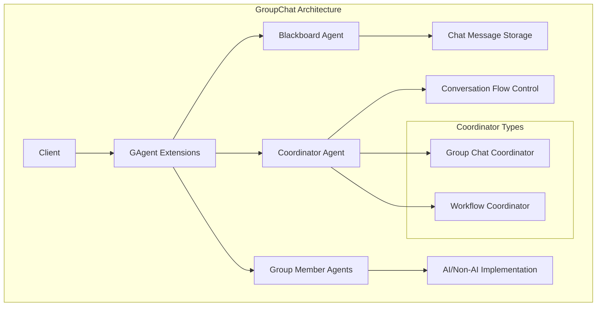
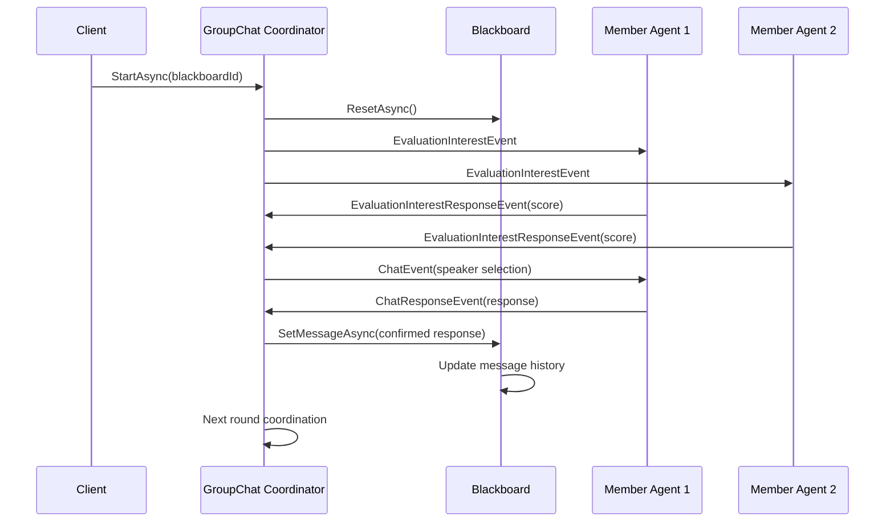

# GroupChat Module Technical Documentation

## Overview

The **Aevatar.GAgents.GroupChat** module provides a comprehensive framework for implementing distributed group chat functionality using the Orleans actor model. This module enables multiple AI and non-AI agents to participate in coordinated conversations through a blackboard pattern, with support for both free-form group discussions and structured workflow-based interactions.

## Architecture Overview

The GroupChat module implements a distributed agent communication system with the following core architectural patterns:

- **Blackboard Pattern**: Centralized message storage and retrieval
- **Coordinator Pattern**: Manages conversation flow and participant selection
- **Event Sourcing**: State persistence through event logs
- **Actor Model**: Distributed agent communication via Orleans grains



## Data Flow Sequence



## Core Components

### 1. Blackboard Agent (`BlackboardGAgent`)

The blackboard serves as the central message repository for group conversations.

**Key Features:**
- **Message Storage**: Maintains ordered list of chat messages
- **Topic Management**: Sets and manages conversation topics
- **Message Filtering**: Retrieves messages by member participation
- **Reset Capability**: Clears conversation history

**State Management:**
```csharp
[GenerateSerializer]
public class BlackboardState : StateBase
{ 
    [Id(0)] public List<ChatMessage> MessageList = new List<ChatMessage>();
}
```

**Core Operations:**
- `SetTopic(string topic)`: Initializes conversation topic
- `GetContent()`: Retrieves all messages
- `GetLastChatMessageAsync(List<Guid> talkerList)`: Filters messages by participants
- `SetMessageAsync(CoordinatorConfirmChatResponse)`: Adds confirmed messages
- `ResetAsync()`: Clears message history

### 2. Coordinator Agents

#### Group Chat Coordinator (`CoordinatorGAgentBase`)

Manages free-form group conversations with interest-based speaker selection.

**Key Features:**
- **Interest-Based Selection**: Chooses speakers based on interest scores
- **Ping/Pong Mechanism**: Monitors active participants
- **Conversation Flow Control**: Manages turn-taking and completion
- **Timer-Based Coordination**: Handles timeouts and rescheduling

**Speaker Selection Algorithm:**
1. Collect interest scores from all members
2. Prioritize members with highest interest (score = 100 gets immediate selection)
3. Randomly select from top 5 interested members
4. Fall back to random selection if no interest data available

#### Workflow Coordinator (`WorkflowCoordinatorGAgent`)

Manages structured, workflow-based conversations with predefined execution order.

**Key Features:**
- **Workflow Definition**: Supports directed acyclic graphs (DAGs)
- **Sequential Execution**: Processes work units in dependency order
- **Loop Detection**: Validates workflow can reach completion
- **Dynamic Reconfiguration**: Supports workflow updates during execution

**Workflow States:**
- `Pending`: Ready to start
- `InProgress`: Currently executing
- `Finished`: Completed successfully

### 3. Group Member Agent Base (`GroupMemberGAgentBase`)

Abstract base class for all group chat participants.

**Key Features:**
- **Interest Evaluation**: Provides interest scores for speaker selection
- **Chat Implementation**: Handles conversation responses
- **Event Handling**: Processes coordination events
- **Configuration Management**: Manages member-specific settings

**Abstract Methods:**
```csharp
protected abstract Task<int> GetInterestValueAsync(Guid blackboardId);
protected abstract Task<ChatResponse> ChatAsync(Guid blackboardId, List<ChatMessage>? coordinatorMessages);
```

**Optional Overrides:**
```csharp
protected virtual Task GroupChatFinishAsync(Guid blackboardId);
protected virtual Task<bool> IgnoreBlackboardPingEvent(Guid blackboardId);
```

## Message Types and Events

### Core Message Types

```csharp
[GenerateSerializer]
public class ChatMessage
{
    [Id(0)] public MessageType MessageType { get; set; }
    [Id(1)] public Guid MemberId { get; set; }
    [Id(2)] public string AgentName { get; set; }
    [Id(3)] public string Content { get; set; }
}

[GenerateSerializer]
public class ChatResponse
{
    [Id(0)] public bool Continue { get; set; } = true;
    [Id(1)] public bool Skip { get; set; } = false;
    [Id(2)] public string Content { get; set; }
}
```

### Event Types

#### Coordination Events
- `EvaluationInterestEvent`: Requests interest scores from members
- `EvaluationInterestResponseEvent`: Member's interest score response
- `ChatEvent`: Notifies selected speaker to respond
- `ChatResponseEvent`: Member's chat response
- `CoordinatorConfirmChatResponse`: Confirmed response for blackboard

#### Lifecycle Events
- `GroupChatFinishEvent`: Signals conversation completion
- `CoordinatorPingEvent`: Heartbeat for active member detection
- `CoordinatorPongEvent`: Member's heartbeat response

#### Workflow Events
- `StartWorkflowCoordinatorEvent`: Initiates workflow execution
- `ResetWorkflowEvent`: Resets workflow state

## Configuration and Setup

### Group Chat Configuration

```csharp
[GenerateSerializer]
public class GroupMemberConfigDto : ConfigurationBase
{
    [Id(0)] public string MemberName { get; set; }
}
```

### Workflow Configuration

```csharp
[GenerateSerializer]
public class WorkflowCoordinatorConfigDto : ConfigurationBase
{
    [Id(0)] public List<WorkflowUnitDto> WorkflowUnitList { get; set; } = new();
}

[GenerateSerializer]
public class WorkflowUnitDto
{
    [Id(0)] public string GrainId { get; set; }
    [Id(1)] public string NextGrainId { get; set; }
    [Id(2)] public Dictionary<string,string> ExtendedData { get; set; } = new();
}
```

## Usage Patterns

### 1. Basic Group Chat Setup

```csharp
// Extension method for simple group chat setup
public static async Task<bool> AddGroupChat(this IGAgent agent, IClusterClient clusterClient, string topic)
{
    var blackboard = clusterClient.GetGrain<IBlackboardGAgent>(Guid.NewGuid());
    if (await blackboard.SetTopic(topic) == false)
    {
        return false;
    }

    await agent.RegisterAsync(blackboard);
    var coordinatorGAgent = clusterClient.GetGrain<ICoordinatorGAgent>(blackboard.GetPrimaryKey());
    await agent.RegisterAsync(coordinatorGAgent);

    await coordinatorGAgent.StartAsync(blackboard.GetPrimaryKey());
    return true;
}
```

### 2. Workflow-Based Group Chat

```csharp
public static async Task AddWorkflowGroupChat(this IGAgent agent, IGAgentFactory agentFactory, List<WorkflowUnitDto> workflowUnitList)
{
    var workflowCoordinator = await agentFactory.GetGAgentAsync<IWorkflowCoordinatorGAgent>(Guid.NewGuid());
    await workflowCoordinator.ConfigAsync(new WorkflowCoordinatorConfigDto()
    {
        WorkflowUnitList = workflowUnitList
    });
    
    await agent.RegisterAsync(workflowCoordinator);
}
```

### 3. Implementing a Group Member

```csharp
public class MyGroupMemberAgent : GroupMemberGAgentBase<MyState, MyStateLogEvent, MyEvent, GroupMemberConfigDto>
{
    protected override async Task<int> GetInterestValueAsync(Guid blackboardId)
    {
        // Return interest score (0-100)
        // 100 = highest priority, immediate selection
        // 0 = no interest
        return await CalculateInterestScore(blackboardId);
    }

    protected override async Task<ChatResponse> ChatAsync(Guid blackboardId, List<ChatMessage>? coordinatorMessages)
    {
        // Implement conversation logic
        var response = await GenerateResponse(blackboardId, coordinatorMessages);
        
        return new ChatResponse
        {
            Content = response,
            Continue = true, // Set to false to end conversation
            Skip = false     // Set to true to skip this turn
        };
    }
}
```

## Performance Considerations

### Scalability Features
- **Distributed Architecture**: Orleans grains provide horizontal scaling
- **Event Sourcing**: Efficient state persistence and recovery
- **Streaming**: Orleans streams for high-throughput event processing
- **Caching**: In-memory state caching for fast access

### Optimization Guidelines
- **Interest Evaluation**: Keep interest calculation lightweight
- **Message Filtering**: Use selective message retrieval for large conversations
- **Workflow Validation**: Validate DAG structure before execution
- **Heartbeat Frequency**: Tune ping/pong intervals based on requirements

## Error Handling and Recovery

### Common Error Scenarios
1. **Member Disconnection**: Detected via ping/pong timeout
2. **Workflow Loops**: Prevented by DAG validation
3. **State Corruption**: Recovered through event sourcing
4. **Network Partitions**: Handled by Orleans clustering

### Recovery Mechanisms
- **Automatic Retry**: Built-in Orleans grain recovery
- **State Reconstruction**: Event sourcing enables full state recovery
- **Workflow Reset**: `ResetWorkflowEvent` for workflow recovery
- **Blackboard Reset**: `ResetAsync()` for conversation restart

## Extension Points

### Custom Coordinators
Extend `CoordinatorGAgentBase<TState, TStateLogEvent>` to implement custom coordination logic:

```csharp
public class CustomCoordinator : CoordinatorGAgentBase<CustomState, CustomLogEvent>
{
    protected override async Task<Guid> CoordinatorToSpeak(List<InterestInfo> interestInfos, List<GroupMember> members)
    {
        // Custom speaker selection logic
        return await MyCustomSelectionAlgorithm(interestInfos, members);
    }
}
```

### Custom Member Behaviors
Override virtual methods in `GroupMemberGAgentBase` for specialized behavior:

```csharp
protected override async Task GroupChatFinishAsync(Guid blackboardId)
{
    // Custom cleanup logic when conversation ends
    await PerformCustomCleanup(blackboardId);
}

protected override async Task<bool> IgnoreBlackboardPingEvent(Guid blackboardId)
{
    // Custom logic to ignore ping events
    return await ShouldIgnorePing(blackboardId);
}
```

## Dependencies

### Required Packages
- **Aevatar.Core**: Core GAgent framework
- **Aevatar.GAgents.AIGAgent**: AI agent base classes
- **Microsoft.Orleans**: Orleans distributed computing framework
- **Microsoft.Extensions.Logging**: Logging infrastructure

### Framework Integration
- **ABP Framework**: Dependency injection and modularity
- **Event Sourcing**: State persistence and recovery
- **Orleans Streams**: Event distribution and processing
- **MongoDB/Redis**: State storage and clustering

## Troubleshooting

### Common Issues

1. **Agents Not Responding**
   - Check Orleans cluster connectivity
   - Verify grain activation and registration
   - Monitor ping/pong heartbeats

2. **Workflow Stuck**
   - Validate DAG structure for loops
   - Check work unit dependencies
   - Verify agent registration status

3. **Message Loss**
   - Confirm blackboard connectivity
   - Check event sourcing persistence
   - Verify Orleans stream configuration

4. **Performance Issues**
   - Monitor grain activation patterns
   - Optimize interest calculation methods
   - Tune coordinator timing parameters

### Debugging Tools
- **Orleans Dashboard**: Monitor grain status and performance
- **Logging**: Comprehensive logging throughout the framework
- **Event Tracing**: Track event flow and processing
- **State Inspection**: Direct access to grain state for debugging

## Best Practices

1. **Agent Design**
   - Keep interest calculation methods lightweight
   - Implement proper error handling in chat methods
   - Use meaningful member names for debugging

2. **Workflow Design**
   - Validate DAG structure before deployment
   - Keep work units focused and atomic
   - Plan for error recovery and retries

3. **Resource Management**
   - Monitor conversation history size
   - Implement appropriate cleanup strategies
   - Use selective message retrieval for performance

4. **Testing**
   - Use Orleans TestKit for unit testing
   - Test workflow validation logic thoroughly
   - Mock external dependencies appropriately

---

*This documentation covers the core functionality of the GroupChat module. For specific implementation examples and advanced usage patterns, refer to the example projects and integration tests.*