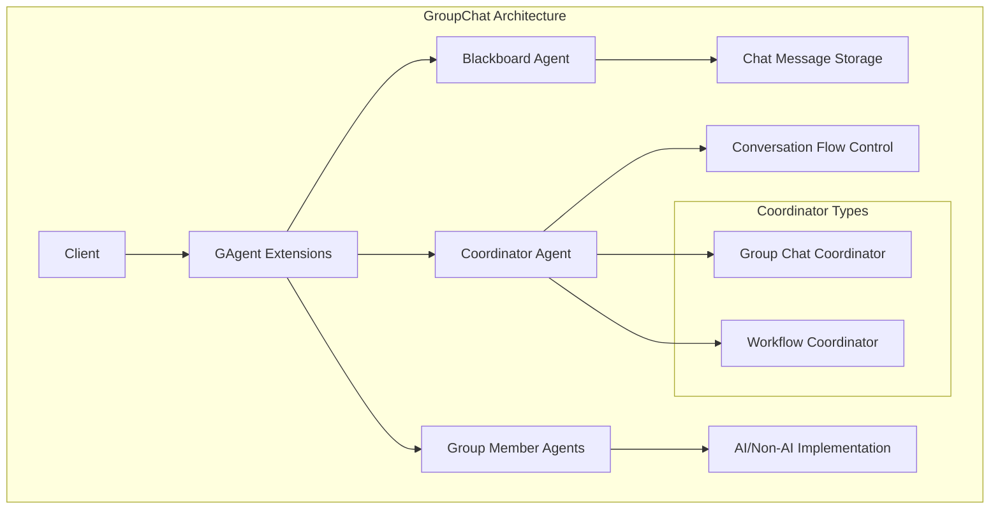
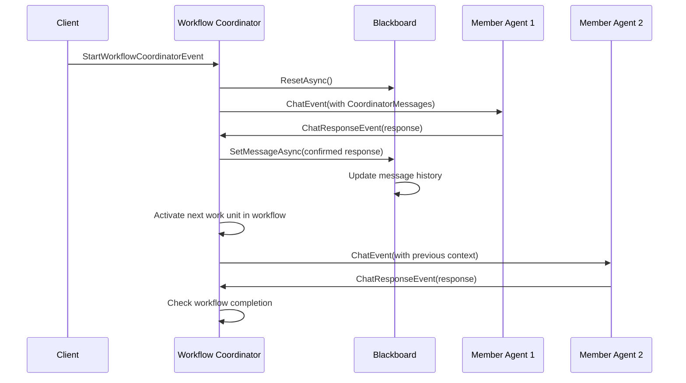

# GroupChat Module Technical Documentation

## Overview

The **Aevatar.GAgents.GroupChat** module provides a comprehensive framework for implementing distributed group chat functionality using the Orleans actor model. This module enables multiple AI and non-AI agents to participate in coordinated conversations through a blackboard pattern, with support for both free-form group discussions and structured workflow-based interactions.

## Architecture Overview

The GroupChat module implements a distributed agent communication system with the following core architectural patterns:

- **Blackboard Pattern**: Centralized message storage and retrieval
- **Coordinator Pattern**: Manages conversation flow and participant selection
- **Event Sourcing**: State persistence through event logs
- **Actor Model**: Distributed agent communication via Orleans grains



## Data Flow Sequence



## Core Components

### 1. Blackboard Agent (`BlackboardGAgent`)

The blackboard serves as the central message repository for group conversations.

**Key Features:**
- **Message Storage**: Maintains ordered list of chat messages
- **Topic Management**: Sets and manages conversation topics
- **Message Filtering**: Retrieves messages by member participation
- **Reset Capability**: Clears conversation history

**State Management:**
```csharp
[GenerateSerializer]
public class BlackboardState : StateBase
{ 
    [Id(0)] public List<ChatMessage> MessageList = new List<ChatMessage>();
}
```

**Core Operations:**
- `SetTopic(string topic)`: Initializes conversation topic
- `GetContent()`: Retrieves all messages
- `GetLastChatMessageAsync(List<Guid> talkerList)`: Filters messages by participants
- `SetMessageAsync(CoordinatorConfirmChatResponse)`: Adds confirmed messages
- `ResetAsync()`: Clears message history

### 2. Coordinator Agents

#### Group Chat Coordinator (`CoordinatorGAgentBase`)

Manages free-form group conversations with interest-based speaker selection.

**Key Features:**
- **Interest-Based Selection**: Chooses speakers based on interest scores
- **Ping/Pong Mechanism**: Monitors active participants
- **Conversation Flow Control**: Manages turn-taking and completion
- **Timer-Based Coordination**: Handles timeouts and rescheduling

**Speaker Selection Algorithm:**
1. Collect interest scores from all members
2. Prioritize members with highest interest (score = 100 gets immediate selection)
3. Randomly select from top 5 interested members
4. Fall back to random selection if no interest data available

#### Workflow Coordinator (`WorkflowCoordinatorGAgent`)

Manages structured, workflow-based conversations with predefined execution order.

**Key Features:**
- **Workflow Definition**: Supports directed acyclic graphs (DAGs)
- **Sequential Execution**: Processes work units in dependency order
- **Loop Detection**: Validates workflow can reach completion
- **Dynamic Reconfiguration**: Supports workflow updates during execution
- **Error Handling**: Proper failure states and recovery mechanisms
- **Initial Content Support**: Can start workflows with predefined content

**Enhanced State Management:**
```csharp
[GenerateSerializer]
public class WorkflowCoordinatorState : StateBase
{
    [Id(0)] public Guid BlackboardId { get; set; }
    [Id(1)] public long Term { get; set; } = 0;  // Changed from int to long
    [Id(2)] public List<WorkUnitInfo> CurrentWorkUnitInfos { get; set; } = new();
    [Id(3)] public Dictionary<long, string> TermToWorkUnitGrainId { get; set; } = new();
    [Id(4)] public WorkflowCoordinatorStatus WorkflowStatus { get; set; } = WorkflowCoordinatorStatus.Pending;
    [Id(5)] public List<WorkUnitInfo> BackupWorkUnitInfos { get; set; } = new();
    [Id(6)] public DateTime? LastRunningTime { get; set; }
    [Id(7)] public string? Content { get; set; } = null;  // Initial content support
}
```

**Workflow States:**
- `Pending`: Ready to start
- `InProgress`: Currently executing
- `Failed`: Failed to start or encountered an error

**New Error Handling Features:**
- **WorkflowStartFailedLogEvent**: Handles workflow start failures gracefully
- **Improved State Validation**: Better validation before workflow execution
- **Recovery Mechanisms**: Support for workflow restart after failure

### 3. Group Member Agent Base (`GroupMemberGAgentBase`)

Abstract base class for all group chat participants.

**Key Features:**
- **Interest Evaluation**: Provides interest scores for speaker selection
- **Chat Implementation**: Handles conversation responses
- **Event Handling**: Processes coordination events
- **Configuration Management**: Manages member-specific settings

**Abstract Methods:**
```csharp
protected abstract Task<int> GetInterestValueAsync(Guid blackboardId);
protected abstract Task<ChatResponse> ChatAsync(Guid blackboardId, List<ChatMessage>? coordinatorMessages);
```

**Optional Overrides:**
```csharp
protected virtual Task GroupChatFinishAsync(Guid blackboardId);
protected virtual Task<bool> IgnoreBlackboardPingEvent(Guid blackboardId);
```

## Message Types and Events

### Core Message Types

```csharp
[GenerateSerializer]
public class ChatMessage
{
    [Id(0)] public MessageType MessageType { get; set; }
    [Id(1)] public Guid MemberId { get; set; }
    [Id(2)] public string AgentName { get; set; }
    [Id(3)] public string Content { get; set; }
}

[GenerateSerializer]
public class ChatResponse
{
    [Id(0)] public bool Continue { get; set; } = true;
    [Id(1)] public bool Skip { get; set; } = false;
    [Id(2)] public string Content { get; set; }
}
```

### Enhanced Event Types

#### Coordination Events (Updated with long term support)
- `EvaluationInterestEvent`: Requests interest scores from members
  - `[Id(1)] public long ChatTerm { get; set; }`
- `EvaluationInterestResponseEvent`: Member's interest score response
  - `[Id(3)] public long ChatTerm { get; set; }`
- `ChatEvent`: Notifies selected speaker to respond
  - `[Id(3)] public long Term { get; set; }`
  - `[Id(4)] public List<ChatMessage>? CoordinatorMessages { get; set; }`
- `ChatResponseEvent`: Member's chat response
  - `[Id(4)] public long Term { get; set; }`

#### Enhanced Workflow Events
- `StartWorkflowCoordinatorEvent`: Initiates workflow execution with optional initial content
- `ResetWorkflowEvent`: Resets workflow state
- `WorkflowStartFailedLogEvent`: New event for handling workflow start failures

#### Log Events with Enhanced Term Support
```csharp
[GenerateSerializer]
public class StartWorkUnitLogEvent : WorkflowCoordinatorLogEvent
{
    [Id(0)] public string WorkUnitGrainId { get; set; }
    [Id(1)] public long Term { get; set; }  // Changed from int to long
}

[GenerateSerializer]
public class FinishedWorkUnitLogEvent : WorkflowCoordinatorLogEvent
{
    [Id(0)] public string WorkUnitGrainId { get; set; }
    [Id(1)] public long Term { get; set; }  // Changed from int to long
}

[GenerateSerializer]
public class SetWorkflowCoordinatorLogEvent : WorkflowCoordinatorLogEvent
{
    [Id(0)] public List<WorkflowUnitDto> WorkflowUnit { get; set; } = new();
    [Id(1)] public Guid BlackBoardId { get; set; }
    [Id(2)] public string? InitContent { get; set; } = null;  // New field
}
```

## Configuration and Setup

### Group Chat Configuration

```csharp
[GenerateSerializer]
public class GroupMemberConfigDto : ConfigurationBase
{
    [Id(0)] public string MemberName { get; set; }
}
```

### Enhanced Workflow Configuration

```csharp
[GenerateSerializer]
public class WorkflowCoordinatorConfigDto : ConfigurationBase
{
    [Id(0)] public List<WorkflowUnitDto> WorkflowUnitList { get; set; } = new();
    [Id(1)] public string? InitContent { get; set; } = null;  // New: Initial content support
}

[GenerateSerializer]
public class WorkflowUnitDto
{
    [Id(0)] public string GrainId { get; set; }
    [Id(1)] public string NextGrainId { get; set; }
    [Id(2)] public Dictionary<string,string> ExtendedData { get; set; } = new();
}
```

## Usage Patterns

### 1. Basic Group Chat Setup

```csharp
// Extension method for simple group chat setup
public static async Task<bool> AddGroupChat(this IGAgent agent, IClusterClient clusterClient, string topic)
{
    var blackboard = clusterClient.GetGrain<IBlackboardGAgent>(Guid.NewGuid());
    if (await blackboard.SetTopic(topic) == false)
    {
        return false;
    }

    await agent.RegisterAsync(blackboard);
    var coordinatorGAgent = clusterClient.GetGrain<ICoordinatorGAgent>(blackboard.GetPrimaryKey());
    await agent.RegisterAsync(coordinatorGAgent);

    await coordinatorGAgent.StartAsync(blackboard.GetPrimaryKey());
    return true;
}
```

### 2. Enhanced Workflow-Based Group Chat

```csharp
public static async Task AddWorkflowGroupChat(this IGAgent agent, IGAgentFactory agentFactory, List<WorkflowUnitDto> workflowUnitList)
{
    var workflowCoordinator = await agentFactory.GetGAgentAsync<IWorkflowCoordinatorGAgent>(Guid.NewGuid());
    
    // Enhanced configuration with initial content support
    await workflowCoordinator.ConfigAsync(new WorkflowCoordinatorConfigDto()
    {
        WorkflowUnitList = workflowUnitList,
        InitContent = "Welcome to the workflow discussion!"  // Optional initial content
    });
    
    await agent.RegisterAsync(workflowCoordinator);
}
```

### 3. Starting a Workflow with Custom Content

```csharp
// Start workflow with specific initial content
await workflowCoordinator.PublishAsync(new StartWorkflowCoordinatorEvent
{
    InitContent = "Please analyze the following data and provide recommendations..."
});
```

### 4. Implementing a Group Member with Enhanced Features

```csharp
public class MyGroupMemberAgent : GroupMemberGAgentBase<MyState, MyStateLogEvent, MyEvent, GroupMemberConfigDto>
{
    protected override async Task<int> GetInterestValueAsync(Guid blackboardId)
    {
        // Enhanced interest calculation with context awareness
        var messages = await GetMessageFromBlackboardAsync(blackboardId);
        var relevanceScore = AnalyzeRelevance(messages);
        
        // Return interest score (0-100)
        // 100 = highest priority, immediate selection
        // 0 = no interest
        return relevanceScore;
    }

    protected override async Task<ChatResponse> ChatAsync(Guid blackboardId, List<ChatMessage>? coordinatorMessages)
    {
        // Enhanced chat implementation with coordinator messages
        var context = coordinatorMessages ?? await GetMessageFromBlackboardAsync(blackboardId);
        var response = await GenerateContextAwareResponse(blackboardId, context);
        
        return new ChatResponse
        {
            Content = response,
            Continue = ShouldContinueConversation(context),
            Skip = ShouldSkipTurn(context)
        };
    }

    protected override async Task GroupChatFinishAsync(Guid blackboardId)
    {
        // Custom cleanup logic when conversation ends
        await PerformWorkflowCleanup(blackboardId);
        await SaveConversationSummary(blackboardId);
    }
}
```

## Enhanced State Management Features

### Workflow State Queries

The `WorkflowCoordinatorState` provides enhanced query methods:

```csharp
// Check if all work units are finished
public bool CheckAllWorkUnitFinished()

// Validate if a work unit can progress (dependencies satisfied)
public bool CheckWorkUnitCanProgress(string workUnitGrainId)

// Get upstream/downstream work unit relationships
public List<string> GetUpStreamGrainIds(string currentGrainId)
public List<string> GetDownStreamGrainIds(string currentGrainId)

// Get work units that can start immediately (no dependencies)
public List<string> GetTopUpStreamGrainIds()

// Find work unit by term ID
public WorkUnitInfo? GetWorkUnitFromTerm(long termId)  // Now supports long terms
```

### Enhanced Error Handling

```csharp
// Improved workflow start validation
[EventHandler]
public async Task HandleEventAsync(StartWorkflowCoordinatorEvent @event)
{
    if (State.WorkflowStatus != WorkflowCoordinatorStatus.Pending)
    {
        Logger.LogError("[WorkflowCoordinatorGAgent] The workflow is not ready to run.");
        return;  // Graceful return instead of exception
    }

    if (State.BlackboardId == Guid.Empty || !State.CurrentWorkUnitInfos.Any())
    {
        Logger.LogError("[WorkflowCoordinatorGAgent] The workflow has not been initialized.");
        
        // New: Proper failure state handling
        RaiseEvent(new WorkflowStartFailedLogEvent());
        await ConfirmEvents();
        return;
    }

    // Continue with workflow execution...
}
```

## Performance Considerations

### Scalability Features
- **Distributed Architecture**: Orleans grains provide horizontal scaling
- **Event Sourcing**: Efficient state persistence and recovery
- **Streaming**: Orleans streams for high-throughput event processing
- **Caching**: In-memory state caching for fast access
- **Long Term Support**: Enhanced term handling for large-scale workflows

### Optimization Guidelines
- **Interest Evaluation**: Keep interest calculation lightweight
- **Message Filtering**: Use selective message retrieval for large conversations
- **Workflow Validation**: Validate DAG structure before execution
- **Heartbeat Frequency**: Tune ping/pong intervals based on requirements
- **Term Management**: Use long terms for workflows with many steps

## Error Handling and Recovery

### Enhanced Error Scenarios
1. **Member Disconnection**: Detected via ping/pong timeout
2. **Workflow Loops**: Prevented by DAG validation
3. **Workflow Start Failures**: Handled with proper error states
4. **State Corruption**: Recovered through event sourcing
5. **Network Partitions**: Handled by Orleans clustering
6. **Long-Running Workflows**: Support for extended execution periods

### Recovery Mechanisms
- **Automatic Retry**: Built-in Orleans grain recovery
- **State Reconstruction**: Event sourcing enables full state recovery
- **Workflow Reset**: `ResetWorkflowEvent` for workflow recovery
- **Blackboard Reset**: `ResetAsync()` for conversation restart
- **Failure State Recovery**: Workflows can be restarted from Failed state

## Advanced Features

### Context-Aware Messaging

The enhanced system now supports context-aware messaging through `CoordinatorMessages`:

```csharp
// Workflow coordinator passes relevant context to work units
var upstreamGrains = State.GetUpStreamGrainIds(workUnitGrainId).Select(s => GrainId.Parse(s).GetGuidKey());
var blackboard = GrainFactory.GetGrain<IBlackboardGAgent>(State.BlackboardId);
var messages = await blackboard.GetLastChatMessageAsync(upstreamGrains.ToList());

if (content != null)
{
    messages.Add(new ChatMessage() { MessageType = MessageType.BlackboardTopic, Content = content });
}

await PublishP2PAsync(speaker, new ChatEvent()
{
    BlackboardId = State.BlackboardId, 
    Speaker = speaker.GetGuidKey(), 
    Term = State.Term,
    CoordinatorMessages = messages  // Context from upstream work units
});
```

### Workflow Lifecycle Management

Enhanced workflow lifecycle with proper state transitions:

```csharp
// State transitions now include Failed state
case WorkflowStartLogEvent:
    State.WorkflowStatus = WorkflowCoordinatorStatus.InProgress;
    State.LastRunningTime = DateTime.UtcNow;
    break;

case WorkflowStartFailedLogEvent:
    State.WorkflowStatus = WorkflowCoordinatorStatus.Failed;
    State.LastRunningTime = DateTime.UtcNow;
    break;

// Workflows can be reconfigured from Failed state
if (State.WorkflowStatus == WorkflowCoordinatorStatus.Pending || 
    State.WorkflowStatus == WorkflowCoordinatorStatus.Failed)
{
    State.CurrentWorkUnitInfos = nodeList;
    State.WorkflowStatus = WorkflowCoordinatorStatus.Pending;
}
```

## Extension Points

### Custom Coordinators
Extend `CoordinatorGAgentBase<TState, TStateLogEvent>` to implement custom coordination logic:

```csharp
public class CustomCoordinator : CoordinatorGAgentBase<CustomState, CustomLogEvent>
{
    protected override async Task<Guid> CoordinatorToSpeak(List<InterestInfo> interestInfos, List<GroupMember> members)
    {
        // Custom speaker selection logic with enhanced context
        return await MyCustomSelectionAlgorithm(interestInfos, members);
    }

    protected override async Task<bool> NeedCheckMemberInterestValue(List<GroupMember> members, Guid blackboardId)
    {
        // Custom logic for when to check member interest
        return await ShouldCheckInterest(members, blackboardId);
    }
}
```

### Custom Workflow Coordinators

```csharp
public class CustomWorkflowCoordinator : WorkflowCoordinatorGAgent
{
    protected override async Task TryActiveWorkUnitAsync(string workUnitGrainId, string? content = null)
    {
        // Enhanced work unit activation with custom logic
        await PreActivationValidation(workUnitGrainId);
        await base.TryActiveWorkUnitAsync(workUnitGrainId, content);
        await PostActivationTracking(workUnitGrainId);
    }
}
```

## Dependencies

### Required Packages
- **Aevatar.Core**: Core GAgent framework
- **Aevatar.GAgents.AIGAgent**: AI agent base classes
- **Microsoft.Orleans**: Orleans distributed computing framework
- **Microsoft.Extensions.Logging**: Logging infrastructure
- **Newtonsoft.Json**: JSON serialization for configuration

### Framework Integration
- **ABP Framework**: Dependency injection and modularity
- **Event Sourcing**: State persistence and recovery
- **Orleans Streams**: Event distribution and processing
- **MongoDB/Redis**: State storage and clustering

## Testing and Examples

### Sample Projects
The module includes sample projects demonstrating various usage patterns:

- **GroupChat.Silo**: Orleans silo configuration and hosting
- **GroupChat.Client**: Client applications for testing
- **GroupChat.Grains**: Sample grain implementations

### Test Coverage
Comprehensive test coverage includes:

- **Unit Tests**: Individual component testing
- **Integration Tests**: End-to-end workflow testing
- **Performance Tests**: Scalability and load testing

## Troubleshooting

### Common Issues

1. **Agents Not Responding**
   - Check Orleans cluster connectivity
   - Verify grain activation and registration
   - Monitor ping/pong heartbeats
   - Validate workflow status is not Failed

2. **Workflow Stuck**
   - Validate DAG structure for loops
   - Check work unit dependencies
   - Verify agent registration status
   - Check if workflow is in Failed state

3. **Message Loss**
   - Confirm blackboard connectivity
   - Check event sourcing persistence
   - Verify Orleans stream configuration
   - Validate CoordinatorMessages flow

4. **Performance Issues**
   - Monitor grain activation patterns
   - Optimize interest calculation methods
   - Tune coordinator timing parameters
   - Consider term management for large workflows

### Debugging Tools
- **Orleans Dashboard**: Monitor grain status and performance
- **Logging**: Comprehensive logging throughout the framework
- **Event Tracing**: Track event flow and processing
- **State Inspection**: Direct access to grain state for debugging
- **Workflow Status Monitoring**: Track workflow state transitions

## Best Practices

1. **Agent Design**
   - Keep interest calculation methods lightweight
   - Implement proper error handling in chat methods
   - Use meaningful member names for debugging
   - Handle CoordinatorMessages appropriately

2. **Workflow Design**
   - Validate DAG structure before deployment
   - Keep work units focused and atomic
   - Plan for error recovery and retries
   - Use InitContent for workflow context

3. **Resource Management**
   - Monitor conversation history size
   - Implement appropriate cleanup strategies
   - Use selective message retrieval for performance
   - Consider long-term storage for extended workflows

4. **Error Handling**
   - Implement graceful failure handling
   - Use WorkflowStartFailedLogEvent for proper error states
   - Plan for workflow recovery scenarios
   - Monitor workflow execution times

5. **Testing**
   - Use Orleans TestKit for unit testing
   - Test workflow validation logic thoroughly
   - Mock external dependencies appropriately
   - Test failure scenarios and recovery

---

*This documentation covers the comprehensive functionality of the GroupChat module, including recent enhancements for improved error handling, long-term support, and context-aware messaging. For specific implementation examples and advanced usage patterns, refer to the sample projects and integration tests.*