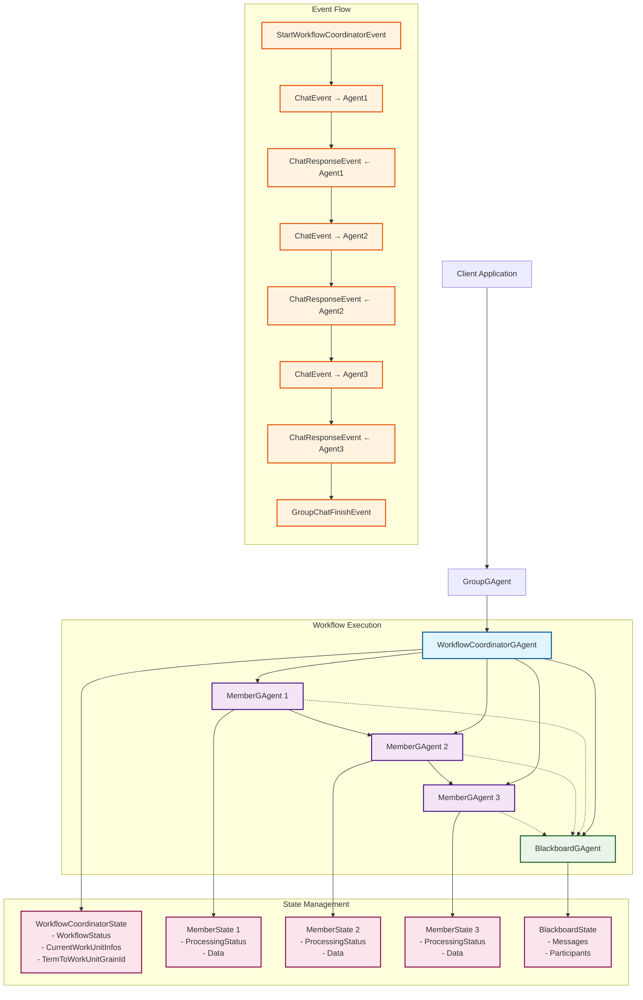
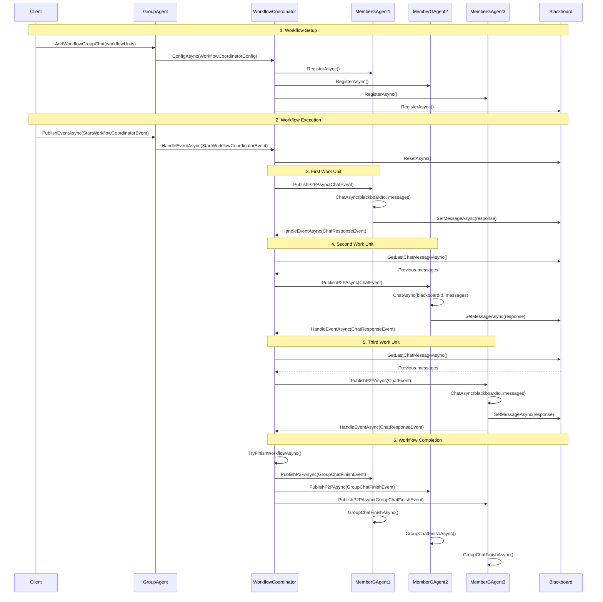
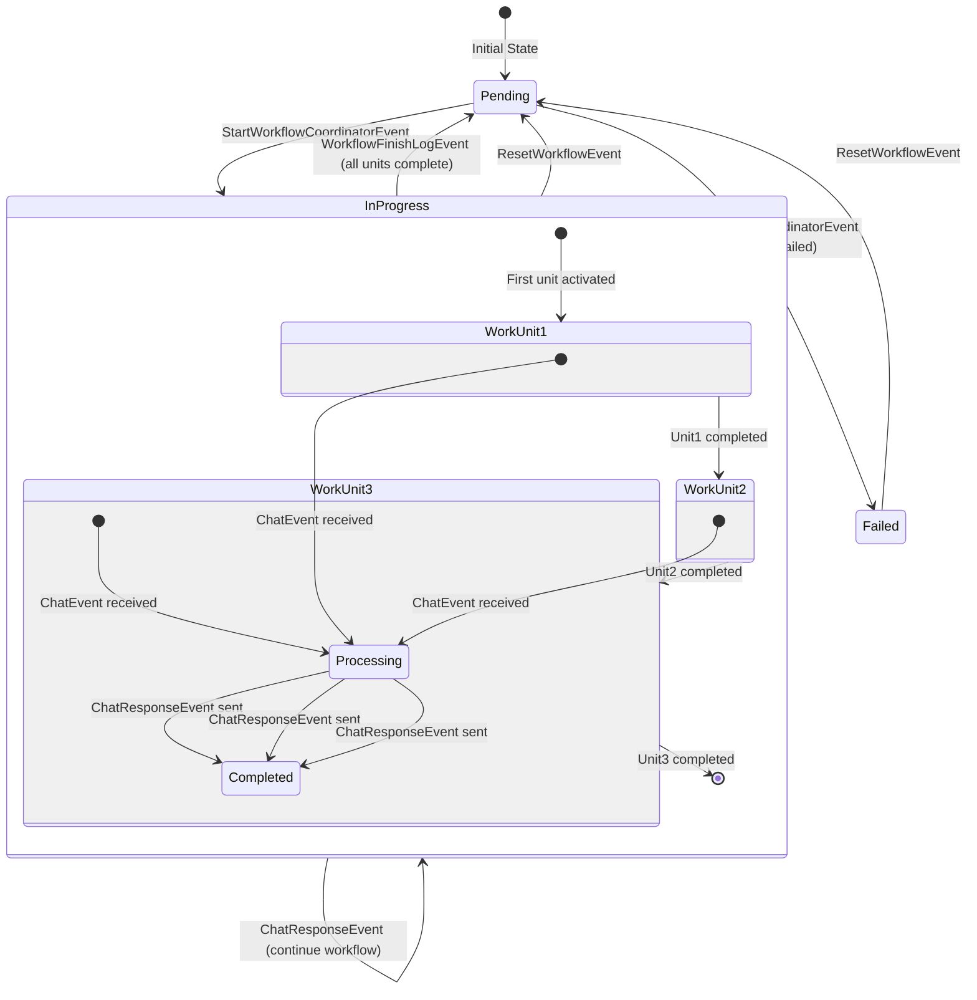

# WorkflowCoordinator Integration Guide

This guide explains how to create agents that work with the `WorkflowCoordinatorGAgent` to build complex workflow systems. There are two primary approaches: using `MemberGAgentBase` (recommended) or implementing the required events directly.

## Table of Contents
- [Overview](#overview)
- [Approach 1: Using MemberGAgentBase](#approach-1-using-membergagentbase)
- [Approach 2: Direct Event Implementation](#approach-2-direct-event-implementation)
- [Workflow Configuration](#workflow-configuration)
- [Advanced Features](#advanced-features)
- [Best Practices](#best-practices)

## Overview

The `WorkflowCoordinatorGAgent` orchestrates the execution of multiple agents in a defined workflow sequence. It manages:
- Agent registration and lifecycle
- Event routing between agents
- Workflow state transitions
- Completion detection

### Key Concepts
- **Work Unit**: An individual agent in the workflow
- **Workflow**: A directed graph of work units
- **Blackboard**: Shared state storage for the workflow
- **Term**: Unique identifier for each workflow execution step

## Architecture Diagram



## Detailed Interaction Flow



## State Transition Diagram



## Component Interaction Overview

The diagram above shows how the WorkflowCoordinator and MemberGAgent work together:

1. **Registration Phase**: The coordinator registers all member agents as child grains
2. **Execution Phase**: The coordinator sends `ChatEvent` to active work units
3. **Processing Phase**: Member agents process their work and return `ChatResponseEvent`
4. **Coordination Phase**: The coordinator manages workflow progression based on responses
5. **Completion Phase**: When all units finish, the coordinator sends `GroupChatFinishEvent`

### Key Integration Points

- **Grain Delegation**: MemberGAgents are registered as children of WorkflowCoordinator
- **Event Routing**: All events flow through Orleans streams with proper addressing
- **State Synchronization**: Blackboard maintains shared state accessible to all agents
- **Workflow Control**: Coordinator manages the execution flow based on workflow configuration

## Approach 1: Using MemberGAgentBase

This is the recommended approach as it provides built-in event handling and grain delegation.

### Basic Implementation

```csharp
using Aevatar.GAgents.GroupChat.Member;
using Aevatar.GAgents.GroupChat.Member.GEvent;

[GAgent]
[StorageProvider(ProviderName = "PubSubStore")]
[LogConsistencyProvider(ProviderName = "LogStorage")]
public class MyWorkflowAgent : MemberGAgentBase<MyAgentState, MyAgentLogEvent, EventBase, MyAgentConfig>, IMyWorkflowAgent
{
    protected override Task<int> GetInterestValueAsync(Guid blackboardId)
    {
        // Return 0-100 indicating interest in participating
        // 0 = no interest, 100 = high interest
        return Task.FromResult(50);
    }

    protected override async Task<ChatResponse> ChatAsync(Guid blackboardId, List<ChatMessage>? coordinatorMessages)
    {
        // Main work method - process messages and return response
        Logger.LogDebug($"Processing {coordinatorMessages?.Count ?? 0} messages");
        
        // Access previous messages from upstream agents
        foreach (var message in coordinatorMessages ?? new List<ChatMessage>())
        {
            Logger.LogDebug($"Message from {message.AgentName}: {message.Content}");
        }
        
        // Perform your agent's work
        var result = await PerformWorkAsync();
        
        // Return response
        return new ChatResponse
        {
            Content = result,
            Continue = true,  // Set false to stop workflow
            Skip = false      // Set true to skip this agent
        };
    }

    protected override Task GroupChatFinishAsync(Guid blackboardId)
    {
        // Optional: Cleanup when workflow completes
        Logger.LogDebug("Workflow completed, cleaning up");
        return Task.CompletedTask;
    }

    private async Task<string> PerformWorkAsync()
    {
        // Your business logic here
        return $"Processed at {DateTime.UtcNow}";
    }
}
```

### State Definition

```csharp
[GenerateSerializer]
public class MyAgentState : MemberState
{
    [Id(0)] public string ProcessingStatus { get; set; } = string.Empty;
    [Id(1)] public int ProcessCount { get; set; }
    [Id(2)] public DateTime LastProcessedAt { get; set; }
}
```

### Configuration DTO

```csharp
[GenerateSerializer]
public class MyAgentConfig : MemberConfigDto
{
    [Id(0)] public string ProcessingMode { get; set; } = "default";
    [Id(1)] public int MaxRetries { get; set; } = 3;
}
```

### Advanced MemberGAgentBase Features

#### Accessing Blackboard Data

```csharp
protected override async Task<ChatResponse> ChatAsync(Guid blackboardId, List<ChatMessage>? coordinatorMessages)
{
    // Get all messages from blackboard
    var allMessages = await GetMessageFromBlackboardAsync(blackboardId);
    
    // Filter messages by type
    var userMessages = allMessages.Where(m => m.MessageType == MessageType.User).ToList();
    var systemMessages = allMessages.Where(m => m.MessageType == MessageType.System).ToList();
    
    // Process based on message history
    if (allMessages.Count > 10)
    {
        return new ChatResponse
        {
            Content = "Too many messages, summarizing...",
            Continue = false
        };
    }
    
    return new ChatResponse { Content = "Processing..." };
}
```

#### Conditional Processing

```csharp
protected override async Task<int> GetInterestValueAsync(Guid blackboardId)
{
    var messages = await GetMessageFromBlackboardAsync(blackboardId);
    
    // High interest if specific conditions are met
    if (messages.Any(m => m.Content.Contains("urgent")))
        return 100;
    
    // Low interest otherwise
    return 10;
}
```

## Approach 2: Direct Event Implementation

For more control, you can implement the required events directly without using `MemberGAgentBase`.

### Required Events to Handle

```csharp
[GAgent]
[StorageProvider(ProviderName = "PubSubStore")]
[LogConsistencyProvider(ProviderName = "LogStorage")]
public class CustomWorkflowAgent : GAgentBase<CustomState, CustomLogEvent, EventBase, CustomConfig>, ICustomWorkflowAgent
{
    [EventHandler]
    public async Task HandleEventAsync(EvaluationInterestEvent @event)
    {
        // Respond with interest level
        var interest = await EvaluateInterestAsync(@event.BlackboardId);
        
        await PublishEventAsync(new EvaluationInterestResultEvent
        {
            BlackboardId = @event.BlackboardId,
            InterestValue = interest,
            MemberId = this.GetPrimaryKey(),
            MemberName = State.AgentName
        });
    }

    [EventHandler]
    public async Task HandleEventAsync(ChatEvent @event)
    {
        // Process workflow task
        var response = await ProcessWorkflowTaskAsync(@event);
        
        // Send response back to coordinator
        var coordinatorId = await GetParentAsync();
        if (coordinatorId != default)
        {
            var coordinator = GrainFactory.GetGrain<IWorkflowCoordinatorGAgent>(coordinatorId);
            await PublishP2PAsync(coordinatorId, new ChatResponseEvent
            {
                BlackboardId = @event.BlackboardId,
                Term = @event.Term,
                MemberId = this.GetPrimaryKey(),
                MemberName = State.AgentName,
                ChatResponse = response
            });
        }
    }

    [EventHandler]
    public async Task HandleEventAsync(GroupChatFinishEvent @event)
    {
        // Cleanup on workflow completion
        await CleanupResourcesAsync();
        
        RaiseEvent(new WorkflowCompletedLogEvent
        {
            BlackboardId = @event.BlackboardId,
            CompletedAt = DateTime.UtcNow
        });
        await ConfirmEvents();
    }

    [EventHandler]
    public async Task HandleEventAsync(CoordinatorPingEvent @event)
    {
        // Respond to health check
        await PublishEventAsync(new CoordinatorPongEvent
        {
            MemberId = this.GetPrimaryKey(),
            MemberName = State.AgentName
        });
    }

    private async Task<int> EvaluateInterestAsync(Guid blackboardId)
    {
        // Custom interest evaluation logic
        return 50;
    }

    private async Task<ChatResponse> ProcessWorkflowTaskAsync(ChatEvent @event)
    {
        // Custom processing logic
        return new ChatResponse
        {
            Content = "Processed",
            Continue = true
        };
    }

    private async Task PublishP2PAsync<T>(GrainId grainId, T @event) where T : EventBase
    {
        var streamId = StreamId.Create(AevatarOptions!.StreamNamespace, grainId.ToString());
        var stream = StreamProvider.GetStream<EventWrapperBase>(streamId);
        var eventWrapper = new EventWrapper<T>(@event, Guid.NewGuid(), this.GetGrainId());
        await stream.OnNextAsync(eventWrapper);
    }
}
```

### State for Direct Implementation

```csharp
[GenerateSerializer]
public class CustomState : StateBase
{
    [Id(0)] public string AgentName { get; set; } = string.Empty;
    [Id(1)] public WorkflowStatus Status { get; set; } = WorkflowStatus.Idle;
    [Id(2)] public Dictionary<long, ProcessingResult> TermResults { get; set; } = new();
}
```

## Workflow Configuration

### Setting Up a Workflow

```csharp
// Create workflow agents
var agent1 = await agentFactory.CreateMemberAsync<IAgent1>(
    new Agent1Config { MemberName = "DataProcessor" });

var agent2 = await agentFactory.CreateMemberAsync<IAgent2>(
    new Agent2Config { MemberName = "Validator" });

var agent3 = await agentFactory.CreateMemberAsync<IAgent3>(
    new Agent3Config { MemberName = "Publisher" });

// Define workflow structure
var workflowUnits = new List<WorkflowUnitDto>
{
    new WorkflowUnitDto
    {
        GrainId = agent1.GetGrainId().ToString(),
        NextGrainId = agent2.GetGrainId().ToString(),
        ExtendedData = JsonConvert.SerializeObject(new { priority = "high" })
    },
    new WorkflowUnitDto
    {
        GrainId = agent2.GetGrainId().ToString(),
        NextGrainId = agent3.GetGrainId().ToString()
    },
    new WorkflowUnitDto
    {
        GrainId = agent3.GetGrainId().ToString(),
        NextGrainId = null // Terminal node
    }
};

// Register workflow with coordinator
var groupAgent = GrainFactory.GetGrain<IGroupGAgent>(Guid.NewGuid());
await groupAgent.AddWorkflowGroupChat(agentFactory, workflowUnits);

// Start workflow execution
await groupAgent.PublishEventAsync(new StartWorkflowCoordinatorEvent
{
    InitContent = "Start processing customer data"
});
```

### Complex Workflow Patterns

#### Parallel Execution

```csharp
// Multiple agents can have the same NextGrainId for convergence
var parallelWorkflow = new List<WorkflowUnitDto>
{
    // Start node
    new WorkflowUnitDto
    {
        GrainId = startAgent.GetGrainId().ToString(),
        NextGrainId = parallel1.GetGrainId().ToString()
    },
    // Parallel branch 1
    new WorkflowUnitDto
    {
        GrainId = parallel1.GetGrainId().ToString(),
        NextGrainId = mergeAgent.GetGrainId().ToString()
    },
    // Parallel branch 2 (same start)
    new WorkflowUnitDto
    {
        GrainId = startAgent.GetGrainId().ToString(),
        NextGrainId = parallel2.GetGrainId().ToString()
    },
    new WorkflowUnitDto
    {
        GrainId = parallel2.GetGrainId().ToString(),
        NextGrainId = mergeAgent.GetGrainId().ToString()
    },
    // Merge point
    new WorkflowUnitDto
    {
        GrainId = mergeAgent.GetGrainId().ToString(),
        NextGrainId = null
    }
};
```

#### Conditional Branching

```csharp
public class ConditionalAgent : MemberGAgentBase<ConditionalState, ConditionalLogEvent, EventBase, MemberConfigDto>
{
    protected override async Task<ChatResponse> ChatAsync(Guid blackboardId, List<ChatMessage>? messages)
    {
        var condition = await EvaluateConditionAsync(messages);
        
        // Use Skip to bypass this agent if condition not met
        if (!condition)
        {
            return new ChatResponse
            {
                Content = "Condition not met, skipping",
                Skip = true,
                Continue = true
            };
        }
        
        // Process normally
        return new ChatResponse
        {
            Content = "Condition met, processing",
            Continue = true
        };
    }
}
```

## Advanced Features

### Grain Delegation

Grain delegation allows parent-child relationships between agents:

```csharp
public class DelegatingAgent : MemberGAgentBase<DelegatingState, DelegatingLogEvent, EventBase, MemberConfigDto>
{
    private IGAgent? _subAgent;

    protected override async Task OnActivateAsync(CancellationToken cancellationToken)
    {
        await base.OnActivateAsync(cancellationToken);
        
        // Create and register a sub-agent
        _subAgent = GrainFactory.GetGrain<ISubAgent>(Guid.NewGuid());
        await RegisterAsync(_subAgent);
    }

    protected override async Task<ChatResponse> ChatAsync(Guid blackboardId, List<ChatMessage>? messages)
    {
        // Delegate work to sub-agent
        await _subAgent.PublishEventAsync(new ProcessingEvent
        {
            Data = messages?.FirstOrDefault()?.Content ?? string.Empty
        });
        
        // Wait for sub-agent result
        var result = await WaitForSubAgentResultAsync();
        
        return new ChatResponse
        {
            Content = $"Delegated result: {result}",
            Continue = true
        };
    }

    private async Task<string> WaitForSubAgentResultAsync()
    {
        // Implementation depends on your communication pattern
        // Could use events, state sharing, or direct method calls
        return "Processed by sub-agent";
    }
}
```

### Dynamic Workflow Modification

```csharp
// Workflow can be updated while not running
var newWorkflowUnits = new List<WorkflowUnitDto>
{
    // New workflow configuration
};

// Reconfigure the workflow
await coordinator.ConfigAsync(new WorkflowCoordinatorConfigDto
{
    WorkflowUnitList = newWorkflowUnits,
    InitContent = "Updated workflow"
});
```

### Error Handling and Recovery

```csharp
public class ResilientAgent : MemberGAgentBase<ResilientState, ResilientLogEvent, EventBase, MemberConfigDto>
{
    protected override async Task<ChatResponse> ChatAsync(Guid blackboardId, List<ChatMessage>? messages)
    {
        try
        {
            var result = await ProcessWithRetryAsync();
            return new ChatResponse
            {
                Content = result,
                Continue = true
            };
        }
        catch (Exception ex)
        {
            Logger.LogError(ex, "Processing failed");
            
            // Log failure but continue workflow
            return new ChatResponse
            {
                Content = $"Error: {ex.Message}",
                Continue = true,
                Skip = false
            };
        }
    }

    private async Task<string> ProcessWithRetryAsync()
    {
        var retryCount = 0;
        while (retryCount < State.MaxRetries)
        {
            try
            {
                return await ActualProcessingAsync();
            }
            catch (TransientException)
            {
                retryCount++;
                await Task.Delay(TimeSpan.FromSeconds(Math.Pow(2, retryCount)));
            }
        }
        throw new ProcessingException("Max retries exceeded");
    }
}
```

## Best Practices

### 1. State Management
- Keep state minimal and serializable
- Use event sourcing for audit trails
- Always include `[GenerateSerializer]` and `[Id(n)]` attributes

### 2. Event Handling
- Handle events idempotently
- Always call `ConfirmEvents()` after state changes
- Use proper logging for debugging

### 3. Workflow Design
- Ensure all paths reach a terminal node
- Avoid circular dependencies
- Test workflow paths thoroughly

### 4. Performance
- Keep `ChatAsync` operations lightweight
- Use grain delegation for complex sub-tasks
- Monitor grain activation patterns

### 5. Error Handling
- Never let exceptions escape event handlers
- Use Skip/Continue flags appropriately
- Log errors with context

### 6. Testing
```csharp
[Fact]
public async Task Should_ProcessWorkflow_When_Started()
{
    // Arrange
    var agent = await GetGrainAsync<IMyWorkflowAgent>(Guid.NewGuid());
    await agent.ConfigAsync(new MyAgentConfig { MemberName = "TestAgent" });
    
    // Act
    await agent.HandleEventAsync(new ChatEvent
    {
        BlackboardId = Guid.NewGuid(),
        Term = 1,
        CoordinatorMessages = new List<ChatMessage>
        {
            new() { Content = "Test message" }
        }
    });
    
    // Assert
    var state = await agent.GetStateAsync();
    state.ProcessCount.ShouldBe(1);
}
```

## Conclusion

The WorkflowCoordinatorGAgent provides a powerful framework for orchestrating complex agent workflows. Using `MemberGAgentBase` simplifies implementation while direct event handling offers maximum control. Choose the approach that best fits your requirements and follow the patterns shown above for successful integration.