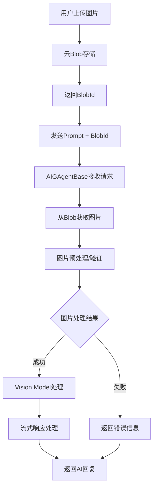
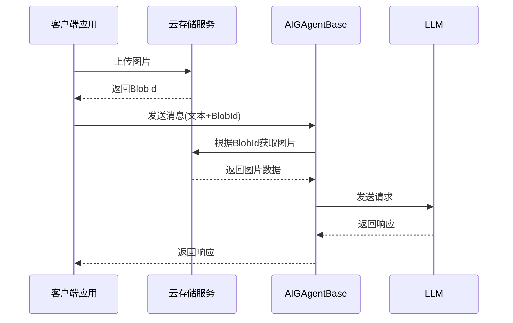

## 方案概述

为了满足用户上传图片作为聊天上下文的需求，本方案将扩展现有的AIGAgent架构，通过集成Vision Model支持，实现图像与文本的多模态处理能力。用户可以上传图片到云存储，然后通过Blob ID与文本提示一起发送给AI Agent进行处理。

## 架构设计

### 核心组件扩展

#### 1. ChatMessage扩展  
为ChatMessage类添加图像内容列表字段，支持单条消息包含多个图像附件。

## 系统流程设计

### 整体流程图

### 详细处理流程

## 关键技术实现点

### 1. 图像获取与处理
- **Blob存储集成**：支持AWS S3云存储服务
- **图像格式验证**：支持JPEG、PNG等常见格式，确保兼容性

### 2. 多模态Brain实现
- **上下文管理**：维护图片与对话历史的关联关系，保证上下文连贯性

### 3. 流式处理扩展
- **异步图片处理**：图片处理不阻塞主流程，提升响应速度

### 4. 存储与清理策略  
- **清理历史消息同时清理图片**：清理过期历史消息是同时清理图片，防止存储空间膨胀

## 配置与管理

### Blob存储配置
支持连接字符串、容器名称、最大文件大小、等全面配置选项。

## 总结

本方案通过扩展现有的AIGAgent架构，实现了完整的多模态AI聊天功能。方案重点关注：

1. **架构扩展性**：基于现有框架进行最小化侵入式扩展，保持系统稳定性
2. **性能优化**：流式处理与异步操作确保优秀的用户体验
3. **用户体验**：直观简洁的交互设计与友好的错误处理

通过这个方案，开发者可以轻松地为他们的AI Agent添加图像处理能力，用户也能获得更丰富的多模态交互体验。该方案具备良好的扩展性和可维护性，能够适应未来多模态AI技术的发展需求。
