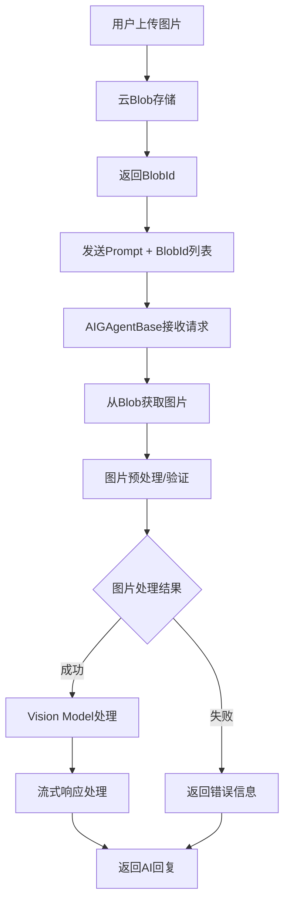
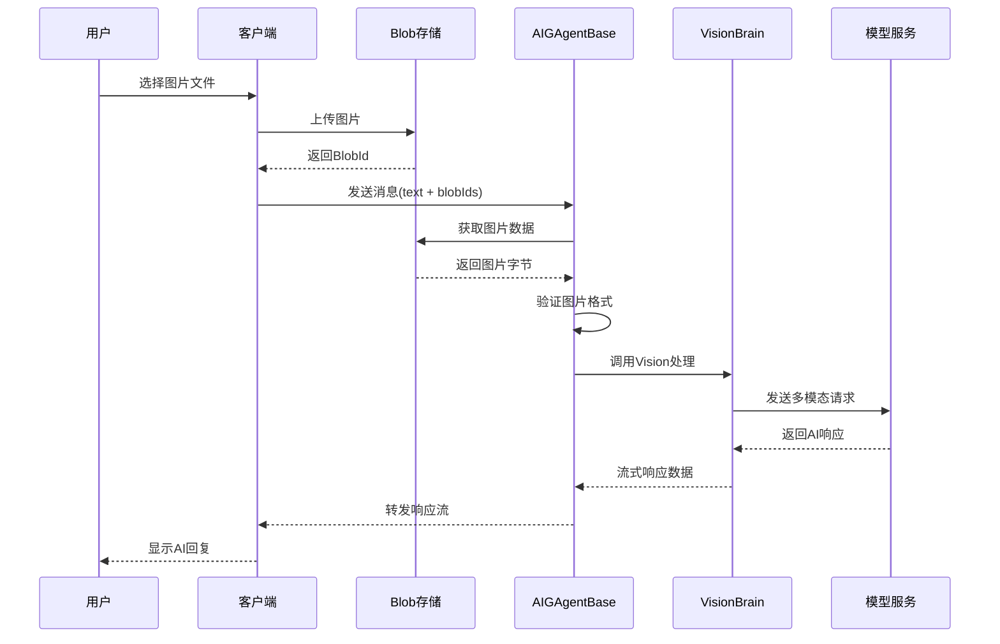

# AIGAgent 图片支持功能方案设计

## 方案概述

为了满足用户上传图片作为聊天上下文的需求，本方案将扩展现有的AIGAgent架构，通过集成Vision Model支持，实现图像与文本的多模态处理能力。用户可以上传图片到云存储，然后通过Blob ID与文本提示一起发送给AI Agent进行处理。

## 架构设计

### 核心组件扩展

#### 1. BrainContentType扩展
在现有的BrainContentType枚举中新增Image和ImageUrl类型，支持图像内容的标识和处理。

```csharp
public enum BrainContentType
{
    Pdf,
    String,
    Image,        // 新增：本地图片二进制数据
    ImageUrl      // 新增：图片URL地址
}
```

#### 2. ChatMessage扩展  
为ChatMessage类添加图像内容列表字段，支持单条消息包含多个图像附件。

```csharp
[GenerateSerializer]
public class ChatMessage
{
    [Id(0)] public ChatRole ChatRole { get; set; }
    [Id(1)] public string? Content { get; set; }
    [Id(2)] public List<string>? ImageBlobIds { get; set; }  // 新增：图片Blob ID列表
}
```

#### 3. Vision Brain接口
创建IVisionBrain接口继承IChatBrain，新增带图像参数的提示调用方法，支持同步和流式两种处理模式。

```csharp
public interface IVisionBrain : IChatBrain
{
    Task<InvokePromptResponse?> InvokePromptWithImagesAsync(
        string content, 
        List<string> imageBlobIds,
        List<ChatMessage>? history = null,
        bool ifUseKnowledge = false, 
        ExecutionPromptSettings? promptSettings = null,
        CancellationToken cancellationToken = default);

    Task<IAsyncEnumerable<object>> InvokePromptWithImagesStreamingAsync(
        string content,
        List<string> imageBlobIds, 
        List<ChatMessage>? history = null,
        bool ifUseKnowledge = false, 
        ExecutionPromptSettings? promptSettings = null,
        CancellationToken cancellationToken = default);
}
```

#### 4. 云Blob存储抽象接口
创建统一的云存储接口，支持多种云服务提供商。

```csharp
public interface IBlobStorageService
{
    Task<byte[]> GetImageAsync(string blobId, CancellationToken cancellationToken = default);
    Task<string> UploadImageAsync(byte[] imageData, string fileName, CancellationToken cancellationToken = default);
    Task<bool> DeleteImageAsync(string blobId, CancellationToken cancellationToken = default);
}

public interface IAWSBlobStorageService : IBlobStorageService
{
    // AWS特定实现
}
```

## 系统流程设计

### 整体流程图



### 详细处理流程



## 技术实现要点

### 1. AIGAgentBase扩展

在AIGAgentBase中添加图片处理方法：

- `ChatWithHistoryAndImages()`: 支持图片的聊天方法
- `PromptWithStreamAndImages()`: 支持图片的流式处理方法
- 图片预处理：格式验证、大小限制、安全检查

### 2. ChatGAgentBase扩展

继承AIGAgentBase的图片功能，添加：
- `ChatAsyncWithImages()`: 带图片的聊天接口
- `ChatWithStreamAndImages()`: 带图片的流式聊天接口
- 聊天历史中图片信息的管理

### 3. Vision Model集成

支持主流Vision模型：
- Azure OpenAI GPT-4V
- Google Gemini Vision
- 其他兼容的Vision API

### 4. AWS Blob存储实现

```csharp
public class AWSBlobStorageService : IAWSBlobStorageService
{
    private readonly AmazonS3Client _s3Client;
    private readonly string _bucketName;
    
    public async Task<byte[]> GetImageAsync(string blobId, CancellationToken cancellationToken = default)
    {
        // S3 GetObject实现
    }
    
    public async Task<string> UploadImageAsync(byte[] imageData, string fileName, CancellationToken cancellationToken = default)
    {
        // S3 PutObject实现
    }
}
```

## 安全性考虑

### 1. 图片验证
- 文件类型白名单：jpg, jpeg, png, gif, webp
- 文件大小限制：最大10MB
- 内容安全扫描：恶意代码检测

### 2. 访问控制
- Blob ID加密处理
- 临时访问Token机制
- 用户权限验证

### 3. 数据保护
- 图片传输加密
- 敏感图片自动删除
- 访问日志记录

## 性能优化

### 1. 图片处理优化
- 图片压缩：自动调整分辨率
- 缓存机制：本地临时缓存
- 并发控制：限制同时处理的图片数量

### 2. 网络优化
- CDN加速：图片分发网络
- 分片上传：大文件分块传输
- 重试机制：网络失败自动重试

## 配置选项

### BlobStorageOptions
```csharp
public class BlobStorageOptions
{
    public string Provider { get; set; } // AWS, Azure, GCP
    public string ConnectionString { get; set; }
    public string BucketName { get; set; }
    public int MaxFileSizeMB { get; set; } = 10;
    public string[] AllowedFileTypes { get; set; } = {"jpg", "jpeg", "png", "gif", "webp"};
}
```

### VisionModelOptions
```csharp
public class VisionModelOptions
{
    public string Provider { get; set; } // OpenAI, Google, Azure
    public string ModelName { get; set; }
    public int MaxImageCount { get; set; } = 5;
    public int MaxImageResolution { get; set; } = 2048;
}
```

## 测试策略

### 1. 单元测试
- Blob存储接口测试
- 图片验证逻辑测试
- Vision Brain功能测试

### 2. 集成测试
- 端到端图片处理流程
- 多种图片格式兼容性
- 错误场景处理验证

### 3. 性能测试
- 大图片处理性能
- 并发访问压力测试
- 存储服务响应时间

## 部署注意事项

### 1. 环境配置
- 云存储服务账号配置
- Vision API密钥设置
- 网络安全组规则

### 2. 监控告警
- 图片处理成功率监控
- 存储服务可用性监控
- Vision API调用频率监控

### 3. 扩容规划
- 存储容量规划
- API调用配额管理
- 服务器资源预估

## 项目里程碑

### Phase 1: 基础架构 (2周)
- Blob存储抽象接口设计
- AWS Blob存储实现
- 基础图片验证功能

### Phase 2: Vision集成 (2周)  
- IVisionBrain接口实现
- Azure OpenAI Vision集成
- AIGAgentBase图片支持

### Phase 3: ChatAgent扩展 (1周)
- ChatGAgentBase图片功能
- 聊天历史图片管理
- 流式处理支持

### Phase 4: 测试优化 (1周)
- 完整测试覆盖
- 性能优化调整
- 文档完善 