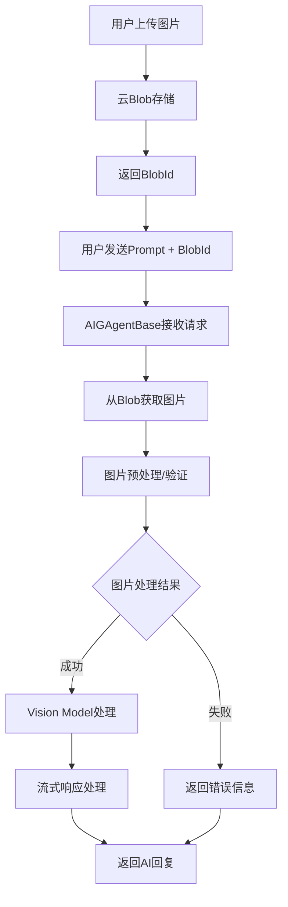
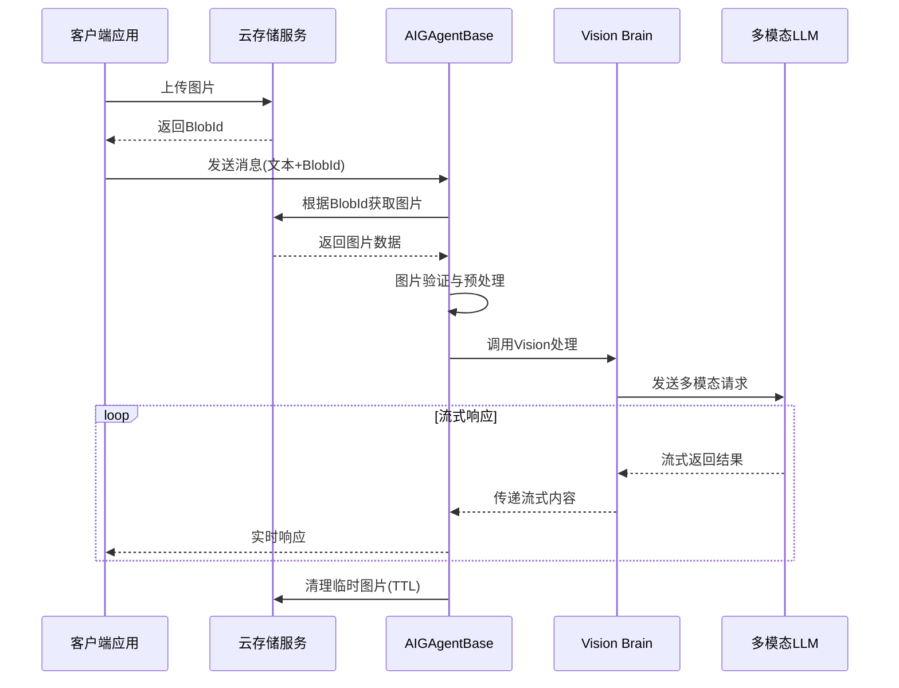

## 方案概述

为了满足用户上传图片作为聊天上下文的需求，本方案将扩展现有的AIGAgent架构，通过集成Vision Model支持，实现图像与文本的多模态处理能力。用户可以上传图片到云存储，然后通过Blob ID与文本提示一起发送给AI Agent进行处理。

## 架构设计

### 核心组件扩展

#### 1. BrainContent扩展
在现有的BrainContentType枚举中新增Image和ImageUrl类型，支持图像内容的标识和处理。

#### 2. ChatMessage扩展  
为ChatMessage类添加图像内容列表字段，支持单条消息包含多个图像附件。

#### 3. Vision Brain接口
创建IVisionBrain接口继承IChatBrain，新增带图像参数的提示调用方法，支持同步和流式两种处理模式。

## 系统流程设计

### 整体流程图

### 详细处理流程

## 关键技术实现点

### 1. 图像获取与处理
- **Blob存储集成**：支持Azure Blob Storage、AWS S3等云存储服务
- **图像格式验证**：支持JPEG、PNG、WebP等常见格式，确保兼容性
- **安全检查**：自动清理EXIF元数据，检测并阻止恶意文件上传
- **尺寸优化**：自动压缩过大图片以适应LLM输入限制，保持图像质量

### 2. 多模态Brain实现
- **Vision Model集成**：支持GPT-4V、Gemini Vision等主流视觉模型
- **上下文管理**：维护图片与对话历史的关联关系，保证上下文连贯性

### 3. 流式处理扩展
- **异步图片处理**：图片处理不阻塞主流程，提升响应速度
- **错误恢复**：图片处理失败时优雅降级到纯文本模式

### 4. 存储与清理策略  
- **TTL管理**：支持可配置的图片保留时间，平衡存储成本与用户体验
- **自动清理**：定时清理过期图片，防止存储空间膨胀

## 配置与管理

### Blob存储配置
支持连接字符串、容器名称、TTL时间、最大文件大小、允许的MIME类型等全面配置选项。

### Vision处理配置  
提供图像处理开关、单消息最大图片数量、最大图像分辨率、图像嵌入功能、支持格式列表等详细配置。

## 错误处理策略

### 1. 图片上传阶段
- **格式不支持**：返回明确的支持格式列表和转换建议
- **文件过大**：提供压缩工具推荐和最大尺寸要求
- **上传失败**：实现智能重试机制，包含指数退避策略

### 2. 图片处理阶段
- **图片损坏**：检测并提示用户重新上传完整图片
- **内容不当**：通过安全过滤器识别并友好提醒用户
- **处理超时**：异步处理模式下提供状态查询接口

### 3. AI处理阶段
- **Vision Model不可用**：自动降级到纯文本模式并通知用户
- **Token超限**：智能图片压缩或分批处理策略
- **API限制**：实现请求队列机制与智能重试策略

## 用户体验设计

### 1. 交互优化
用户可以通过拖拽、点击或粘贴等多种方式上传图片，支持批量上传和预览功能。上传过程中提供清晰的进度指示和状态反馈。

### 2. 响应体验
采用流式处理架构，用户在图片上传完成后即可开始发送消息，无需等待预处理完成。AI响应采用打字机效果，提供自然的对话体验。

### 3. 错误友好
所有错误信息都经过用户友好化处理，避免技术术语，提供明确的解决建议和操作指导。

## 总结

本方案通过扩展现有的AIGAgent架构，实现了完整的多模态AI聊天功能。方案重点关注：

1. **架构扩展性**：基于现有框架进行最小化侵入式扩展，保持系统稳定性
2. **性能优化**：流式处理与异步操作确保优秀的用户体验
3. **安全可靠**：完善的错误处理与多层次安全防护机制
4. **运维友好**：全面的监控、日志与告警体系，便于运维管理
5. **用户体验**：直观简洁的交互设计与友好的错误处理

通过这个方案，开发者可以轻松地为他们的AI Agent添加图像处理能力，用户也能获得更丰富的多模态交互体验。该方案具备良好的扩展性和可维护性，能够适应未来多模态AI技术的发展需求。